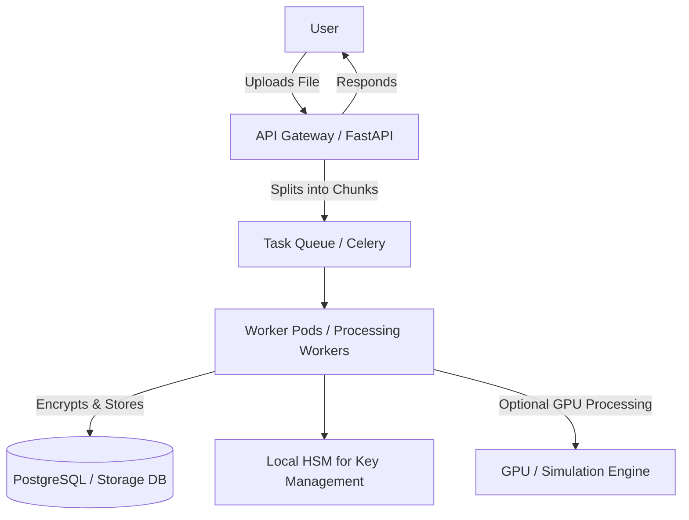

# Cloud Storage Gateway

A secure, scalable cloud storage gateway that allows file uploads, chunking, triple encryption, and distributed storage with optional GPU acceleration.

## Table of Contents

- [Introduction](#introduction)
- [Features](#features)
- [Architecture](#architecture)
- [Installation](#installation)
- [Usage](#usage)
- [Technologies](#technologies)
- [Contributing](#contributing)
- [License](#license)

## Introduction

Cloud Storage Gateway is designed to securely manage file storage in a distributed system. It supports:

- Large file uploads
- Chunk-based processing
- Triple encryption for enhanced security
- Distributed storage workers
- Optional GPU acceleration for file simulation and processing

## Features

- Upload files with automatic chunking
- Triple encryption before storing in the database
- Distributed workers for scalable processing
- Local HSM integration for key management
- Web dashboard for monitoring file uploads and processing

## Architecture

The architecture workflow is explained visually in the Mermaid diagram (see `diagram.mmd`).


## Installation

### Prerequisites

- Python >= 3.10
- PostgreSQL
- Redis (for Celery/Task Queue)
- Docker & Kubernetes (for deployment)
- Optional: CUDA-enabled GPU

### Steps

1. Clone the repository:

```
git clone https://github.com/yourusername/cloud-storage-gateway.git
```
2. Create virtual environements and install packages.
python -m venv venv
source venv/bin/activate
pip install -r requirements.txt

3.Configure .env with your database, Redis, and HSM settings.

4.Start services (locally):
```
docker-compose up
```

5. Run migrations:
```
alembic upgrade head
```

## Usage

Start the FastAPI server:

```
cd cloud-storage-gateway
```

- Use the frontend or API client to upload files. Each file is chunked, encrypted, and stored securely.

# Technologies

- Backend: Python, FastAPI, Celery

- Database: PostgreSQL

- Frontend: React.js (optional)

- Queue/Worker: Redis + Celery

- Deployment: Docker, Kubernetes

- Encryption & Security: Local HSM, Triple Encryption

- Optional: GPU acceleration

# Contributing

1. Fork the repository

2. reate a feature branch

3. Commit your changes

4. Push to your branch

5. Create a Pull Request
